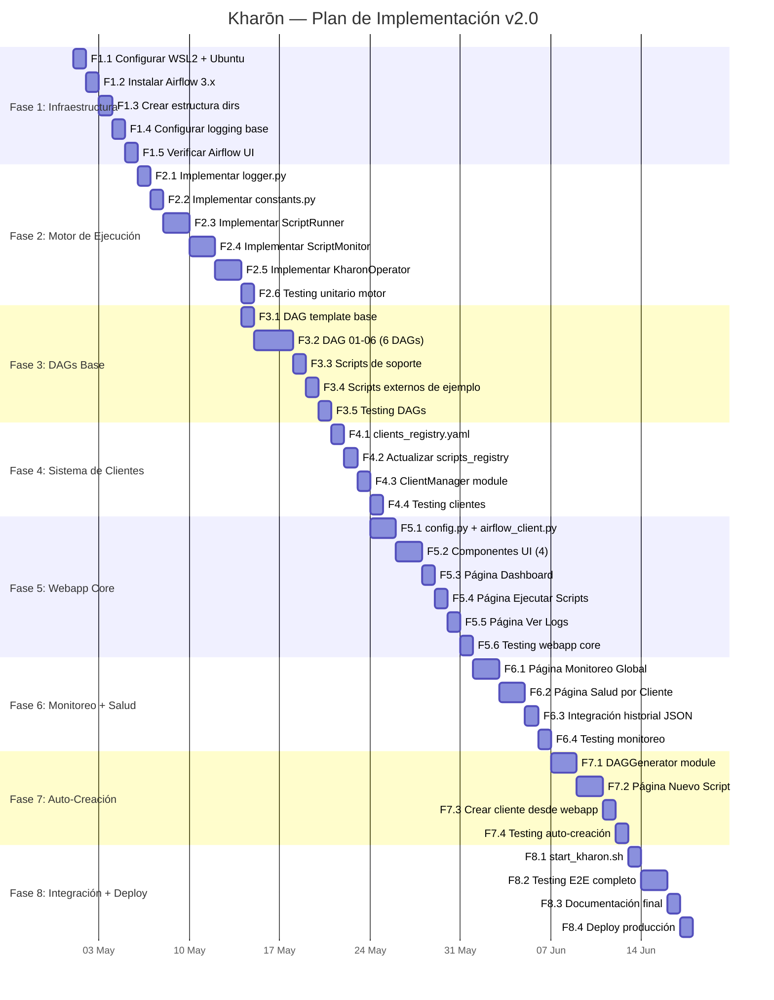
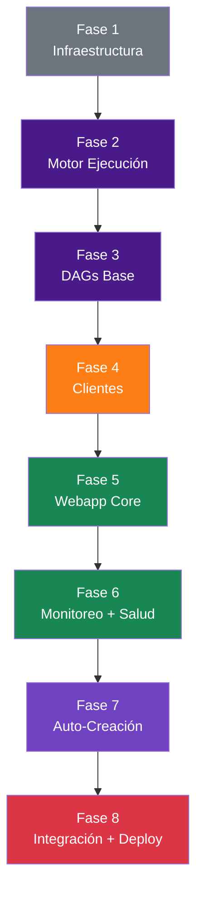
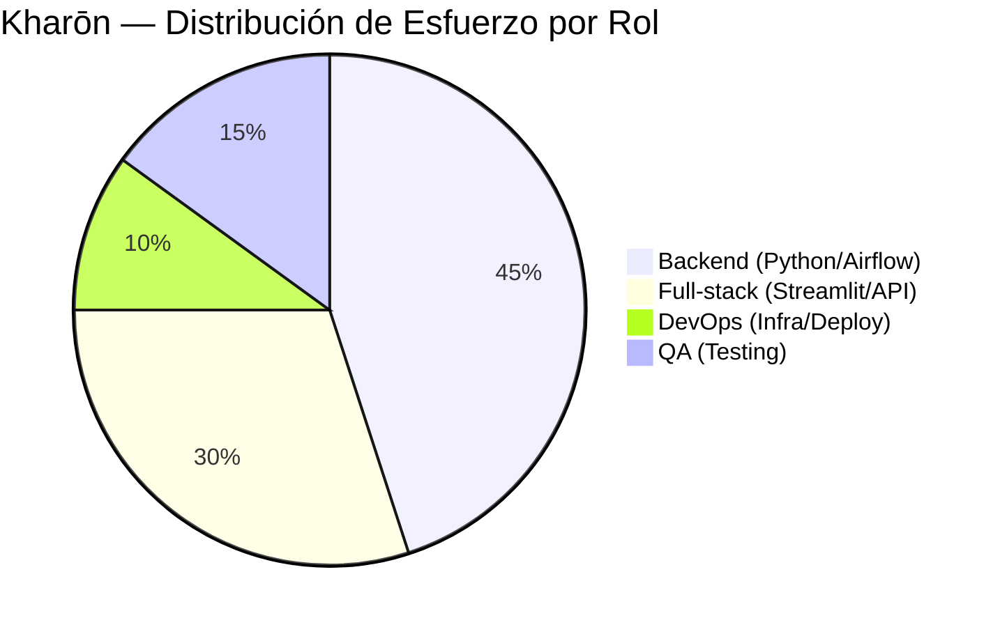

# 📘 Plan de Implementación

# Kharōn — Plan de Implementación

**Empresa:** Arkh-Ur
**Versión:** 2.0
**Fecha:** 2026-04-27
**Duración Estimada:** 5 semanas (25 días hábiles)
**Equipo:** 2-3 desarrolladores Arkh-Ur

---

## 1. Visión General del Plan

---

## 2. Dependencias entre Fases

---

## 3. Criterios de Aceptación por Fase

| Fase | Criterio de Aceptación | Verificación |
|---|---|---|
| **F1** | `airflow version` retorna 3.x, UI accesible en :8080 | Manual |
| **F2** | Script mock se ejecuta vía KharonOperator con logging y reintentos | Unit test |
| **F3** | `airflow dags list` muestra 6+ DAGs sin errores | CLI |
| **F4** | ClientManager carga 4 clientes y genera badges HTML | Unit test |
| **F5** | Kharōn Webapp muestra DAGs, ejecuta scripts, muestra logs | Manual + E2E |
| **F6** | Monitoreo muestra ejecuciones manuales y programadas | Manual |
| **F7** | Script nuevo se registra y ejecuta en < 5 minutos | E2E test |
| **F8** | `start_kharon.sh` levanta todo y queda accesible | Manual |

---

## 4. Estimación de Esfuerzo

| Fase | Días | % del Total |
|---|---|---|
| F1: Infraestructura | 5 | 10% |
| F2: Motor de Ejecución | 9 | 18% |
| F3: DAGs Base | 7 | 14% |
| F4: Clientes | 4 | 8% |
| F5: Webapp Core | 8 | 16% |
| F6: Monitoreo + Salud | 6 | 12% |
| F7: Auto-Creación | 6 | 12% |
| F8: Integración + Deploy | 5 | 10% |
| **Total** | **50** | **100%** |

### Distribución por Rol

---
