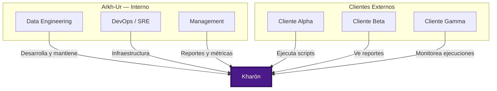
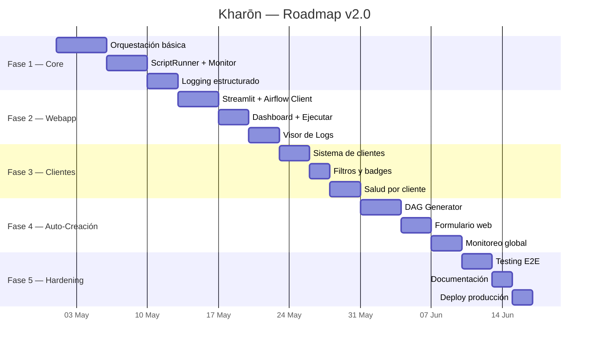

# 📘 PRD — Product Requirements Document

# Kharōn

**Plataforma de Orquestación y Monitoreo de Scripts**

**Empresa:** Arkh-Ur
**Versión:** 2.0
**Fecha:** 2026-04-27
**Autor:** Arkh-Ur — Data Engineering Division
**Estado:** Aprobado

---

## 1. Resumen Ejecutivo

### 1.1 Problema

Las organizaciones ejecutan cientos de scripts Python y Shell de forma manual, sin orquestación, sin monitoreo centralizado, sin trazabilidad, y sin visibilidad sobre qué cliente o proceso falló. Los scripts ya existen y no pueden modificarse.

### 1.2 Solución

**Kharōn** es una plataforma desarrollada por **Arkh-Ur** que orquesta scripts existentes sin modificarlos, proporcionando monitoreo en tiempo real, ejecución bajo demanda vía web, y organización por cliente.

> *En la mitología, Caronte (Kharōn) es el barquero que guía las almas a través del río. De la misma forma, Kharōn guía cada script a través de su flujo de ejecución, monitoreo y registro — sin alterar su naturaleza.*

### 1.3 Propuesta de Valor

| Aspecto | Antes de Kharōn | Con Kharōn |
|---|---|---|
| Ejecución | Manual, cron, sin control | Orquestada, con reintentos y timeouts |
| Monitoreo | Sin visibilidad | Dashboard en tiempo real |
| Logs | Archivos dispersos | Centralizados y consultables vía web |
| Clientes | Sin diferenciación | Badge, color, agrupación por cliente |
| Nuevos scripts | Configuración manual | Auto-registro desde la webapp |
| Trazabilidad | Inexistente | Historial completo de ejecuciones |

---

## 2. Objetivos y Métricas

### 2.1 Objetivos del Producto

| # | Objetivo | Métrica de Éxito | Meta |
|---|---|---|---|
| O1 | Reducir tiempo de incorporación de scripts | Tiempo desde request hasta ejecución | < 5 minutos |
| O2 | Centralizar monitoreo de ejecuciones | % de scripts monitoreados | 100% |
| O3 | Diferenciar ejecuciones por cliente | Scripts con cliente asignado | 100% |
| O4 | Habilitar ejecución bajo demanda | Ejecuciones manuales exitosas | > 99% |
| O5 | Proporcionar trazabilidad completa | Ejecuciones con logs accesibles | 100% |

### 2.2 KPIs

---

## 3. Stakeholders

### 3.1 Roles de Usuario

| Rol | Descripción | Permisos |
|---|---|---|
| **Admin** | Administrador Arkh-Ur del sistema | CRUD completo, configuración |
| **Operador** | Ejecuta scripts on-demand | Ejecutar, ver logs, ver monitoreo |
| **Viewer** | Solo lectura | Ver dashboard, logs, salud |
| **Cliente Admin** | Admin de un cliente específico | Ejecutar y ver scripts de su cliente |

---

## 4. User Stories

### 4.1 Épicas

```mermaid
graph TD
    E1[EP-01: Orquestación] --> US1[US-01: Ejecutar script on-demand]
    E1 --> US2[US-02: Ver progreso de ejecución]
    E1 --> US3[US-03: Reintentar ejecución fallida]
    
    E2[EP-02: Monitoreo] --> US4[US-04: Ver dashboard global]
    E2 --> US5[US-05: Ver logs en tiempo real]
    E2 --> US6[US-06: Recibir alertas de fallo]
    E2 --> US7[US-07: Diferenciar manual vs programado]
    
    E3[EP-03: Clientes] --> US8[US-08: Ver scripts por cliente]
    E3 --> US9[US-09: Filtrar por cliente]
    E3 --> US10[US-10: Crear nuevo cliente]
    
    E4[EP-04: Auto-registro] --> US11[US-11: Registrar script nuevo]
    E4 --> US12[US-12: Auto-generar DAG]
    E4 --> US13[US-13: Eliminar DAG auto-generado]
    
    E5[EP-05: Salud] --> US14[US-14: Ver salud por script]
    E5 --> US15[US-15: Ver salud por cliente]
    E5 --> US16[US-16: Ver historial de ejecuciones]
    
    style E1 fill:#4a1a8a,color:#fff
    style E2 fill:#198754,color:#fff
    style E3 fill:#fd7e14,color:#fff
    style E4 fill:#6f42c1,color:#fff
    style E5 fill:#dc3545,color:#fff
```

### 4.2 Detalle de User Stories

#### EP-01: Orquestación de Scripts

| ID | User Story | Prioridad | Criterios de Aceptación |
|---|---|---|---|
| US-01 | Como operador, quiero ejecutar un script on-demand desde la webapp de Kharōn para no depender de acceso al servidor | P0 | 1. Puedo seleccionar un script de una lista agrupada por cliente 2. Al hacer click en "Ejecutar" se dispara el DAG 3. Veo confirmación con DAG Run ID 4. El script se ejecuta sin modificarse |
| US-02 | Como operador, quiero ver el progreso de una ejecución en tiempo real para saber si está corriendo | P0 | 1. Veo estado de cada tarea (queued/running/success/failed) 2. El estado se actualiza sin recargar 3. Veo badge de cliente asociado |
| US-03 | Como operador, quiero reintentar una ejecución fallida sin intervención manual | P1 | 1. Los reintentos son automáticos según configuración 2. Veo el número de intento en los logs 3. Se registra cada intento en el historial de Kharōn |

#### EP-02: Monitoreo Global

| ID | User Story | Prioridad | Criterios de Aceptación |
|---|---|---|---|
| US-04 | Como admin, quiero ver un dashboard con todas las ejecuciones para tener visibilidad global | P0 | 1. Veo métricas: total, exitosas, fallidas, running 2. Veo distribución por cliente con badges de color 3. Puedo filtrar por tipo (manual/programada) y estado |
| US-05 | Como operador, quiero ver los logs de una tarea en tiempo real desde Kharōn para diagnosticar problemas | P0 | 1. Selecciono DAG → Ejecución → Tarea 2. Veo el log completo con timestamps 3. Puedo descargar el log 4. Opcionalmente auto-refrescar |
| US-06 | Como admin, quiero recibir alertas cuando un script falla para actuar rápidamente | P1 | 1. Alertas en logs por failure, timeout, slow_execution 2. Nivel de alerta según criticidad 3. Registro de alertas en historial |
| US-07 | Como admin, quiero diferenciar ejecuciones manuales de programadas para entender patrones de uso | P0 | 1. Timeline con iconos distintos (manual, programada) 2. Filtro por tipo de ejecución 3. Métricas separadas por tipo |

#### EP-03: Sistema de Clientes

| ID | User Story | Prioridad | Criterios de Aceptación |
|---|---|---|---|
| US-08 | Como admin, quiero ver los scripts agrupados por cliente para entender la distribución de trabajo | P0 | 1. Cada script tiene un cliente asignado 2. El dashboard muestra cards por cliente con color e ícono 3. Cada cliente tiene identidad visual distintiva |
| US-09 | Como operador, quiero filtrar toda la webapp por cliente para enfocarme en un solo contexto | P0 | 1. Filtro global en sidebar 2. Todas las páginas respetan el filtro 3. El filtro persiste durante la sesión |
| US-10 | Como admin, quiero crear nuevos clientes desde Kharōn para no depender de edición manual de YAML | P1 | 1. Formulario con nombre, color, ícono, contacto 2. El cliente queda disponible inmediatamente 3. Se puede asignar a scripts nuevos |

#### EP-04: Auto-registro de Scripts

| ID | User Story | Prioridad | Criterios de Aceptación |
|---|---|---|---|
| US-11 | Como admin, quiero registrar un script existente proporcionando solo su ruta para incorporarlo rápidamente a Kharōn | P0 | 1. Formulario con ruta, nombre, cliente, configuración 2. Preview del script si existe 3. Validación de campos obligatorios |
| US-12 | Como admin, quiero que al registrar un script se genere automáticamente el DAG para no escribir código | P0 | 1. Kharōn genera archivo .py en dags/ 2. Se actualiza scripts_registry.yaml 3. Airflow detecta el DAG en ~30s 4. El script original no se modifica |
| US-13 | Como admin, quiero eliminar un DAG auto-generado desde Kharōn para mantener el sistema limpio | P2 | 1. Botón de eliminación con confirmación 2. Se borra el archivo .py 3. Se elimina del registry 4. Airflow deja de mostrarlo |

#### EP-05: Salud y Métricas

| ID | User Story | Prioridad | Criterios de Aceptación |
|---|---|---|---|
| US-14 | Como admin, quiero ver la salud de cada script (tasa de éxito, fallos consecutivos) para detectar degradación | P0 | 1. Indicador visual 2. Tasa de éxito en % 3. Fallos consecutivos 4. Barra de progreso con color |
| US-15 | Como admin, quiero ver la salud agrupada por cliente para reportar a cada cliente su estado | P0 | 1. Cards por cliente con resumen 2. Detalle expandible por script 3. Métricas: saludables/problemáticos/sin datos |
| US-16 | Como operador, quiero ver el historial completo de ejecuciones de un script para análisis | P1 | 1. Timeline con todas las ejecuciones 2. Filtro por fecha y estado 3. Descarga de datos |

---

## 5. Requisitos No Funcionales

| ID | Requisito | Métrica | Meta |
|---|---|---|---|
| NFR-01 | Tiempo de carga del dashboard | Segundos | < 3s |
| NFR-02 | Disponibilidad del sistema | Uptime | > 99.5% |
| NFR-03 | Escalabilidad de scripts | Scripts simultáneos | > 100 |
| NFR-04 | Retención de logs | Días | 90 días |
| NFR-05 | Tiempo de auto-detección de DAGs | Segundos | < 60s |
| NFR-06 | Concurrencia webapp | Usuarios simultáneos | > 10 |
| NFR-07 | Seguridad | Autenticación | Basic Auth |

---

## 6. Restricciones y Supuestos

### Restricciones

- Los scripts existentes **no se pueden modificar**
- Airflow no tiene soporte nativo para Windows (requiere WSL2)
- La webapp de Kharōn no reemplaza la UI de Airflow, la complementa
- El sistema de clientes es lógico (no multi-tenant a nivel infraestructura)
- Kharōn opera bajo la infraestructura y políticas de Arkh-Ur

### Supuestos

- Todos los scripts son Python (.py) o Shell (.sh)
- Los scripts usan exit codes estándar (0 = éxito)
- Los scripts escriben output a stdout/stderr
- Airflow 3.x está instalado y funcionando
- WSL2 está disponible en Windows

---

## 7. Roadmap

---
