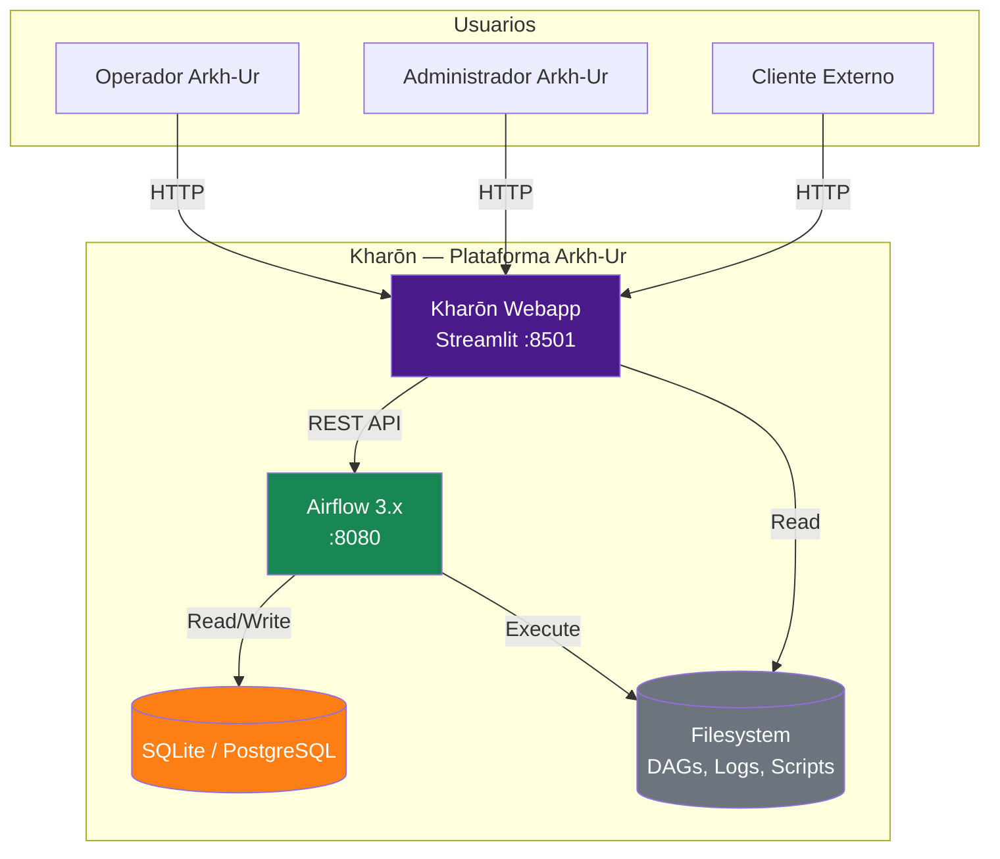
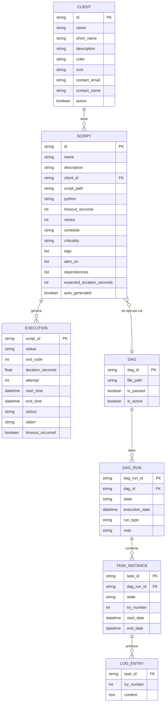
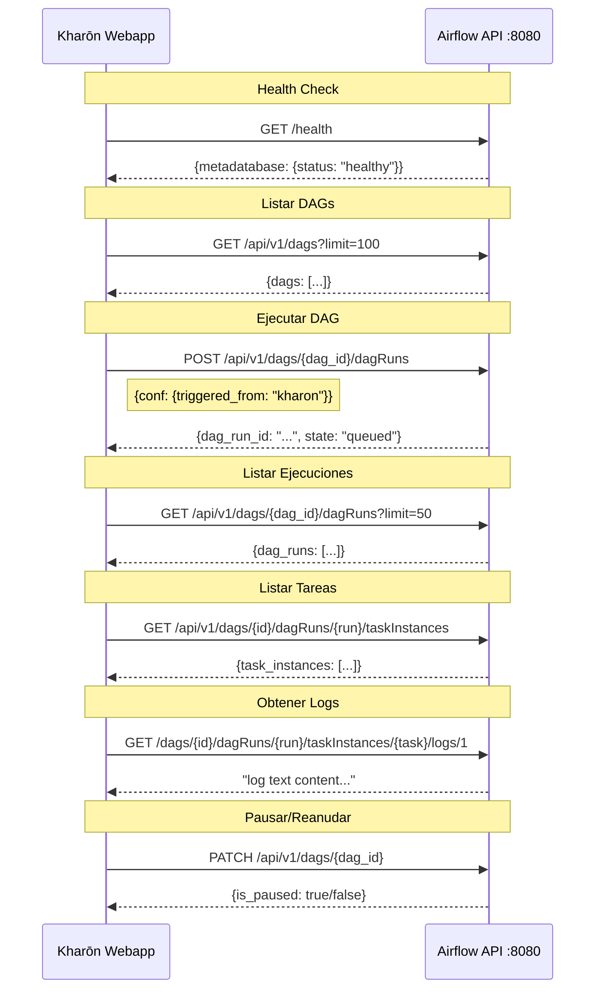
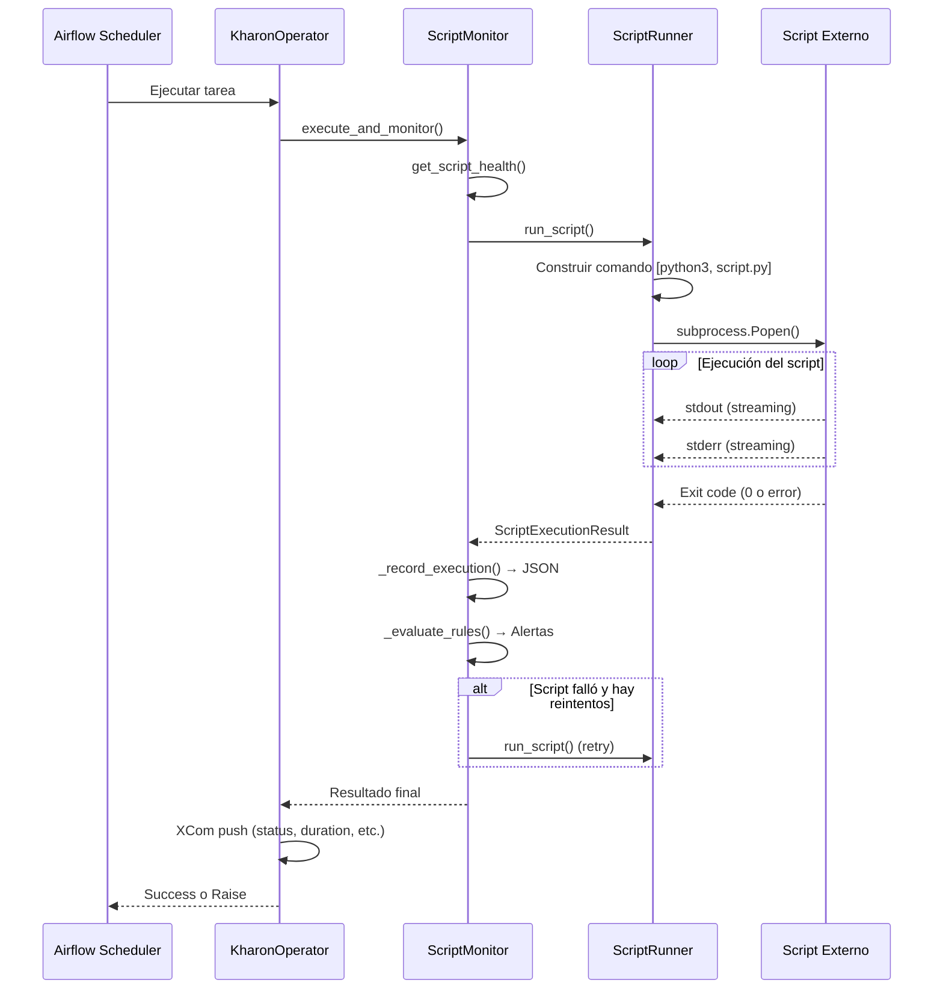

# 📘 TRD — Technical Requirements Document

# Kharōn — Especificación Técnica

**Empresa:** Arkh-Ur
**Versión:** 2.0
**Fecha:** 2026-04-27
**Autor:** Arkh-Ur — Data Engineering Division
**Estado:** Aprobado

---

## 1. Arquitectura del Sistema

### 1.1 Nombre y Branding

| Elemento | Valor |
|---|---|
| **Nombre del producto** | Kharōn |
| **Empresa** | Arkh-Ur |
| **Identificador de paquetes** | `arkh_ur.kharon` |
| **Prefijo DAGs auto-generados** | `kharon_` |
| **Prefijo variables de entorno** | `KHARON_` |
| **Color primario** | `#4a1a8a` (púrpura Arkh-Ur) |
| **Color secundario** | `#0d6efd` |
| **Namespace de logs** | `kharon.monitor`, `kharon.runner`, `kharon.operator` |

### 1.2 Vista General (C4 — Nivel Contexto)



---

## 2. Stack Tecnológico

| Capa | Tecnología | Versión | Propósito |
|---|---|---|---|
| **Orquestador** | Apache Airflow | 3.2.1 | Scheduler, API, Ejecución |
| **Webapp** | Streamlit | >=1.37 | Dashboard y UI de Kharōn |
| **Lenguaje** | Python | 3.10-3.13 | Toda la lógica |
| **Base de datos** | SQLite (dev) / PostgreSQL (prod) | - | Metadata Airflow |
| **Configuración** | YAML | - | Registry de scripts y clientes |
| **Historial** | JSON (filesystem) | - | Monitoreo de scripts |
| **Runtime** | WSL2 + Ubuntu | - | Entorno Linux en Windows |
| **API** | Airflow REST API | v1 | Comunicación webapp ↔ Airflow |
| **HTTP** | requests | >=2.31 | Cliente HTTP |

---

## 3. Modelo de Datos

### 3.1 Entidades Principales



---

## 4. APIs y Interfaces

### 4.1 Airflow REST API — Endpoints Utilizados por Kharōn



### 4.2 ScriptRunner — Ejecución de Scripts



---

## 5. Componentes Técnicos Detallados

### 5.1 ScriptRunner

| Aspecto | Detalle |
|---|---|
| **Clase** | `ScriptRunner` |
| **Namespace** | `kharon.runner` |
| **Mecanismo** | `subprocess.Popen` con timeout |
| **Output** | Captura stdout + stderr completos |
| **Timeout** | `process.communicate(timeout=N)` → `process.kill()` |
| **Parseo** | Busca líneas `RESULT:{json}` en stdout |
| **Aislamiento** | Proceso independiente, sin impacto en Airflow |

### 5.2 ScriptMonitor

| Aspecto | Detalle |
|---|---|
| **Clase** | `ScriptMonitor` |
| **Namespace** | `kharon.monitor` |
| **Historial** | JSON por script en `logs/kharon_monitoring/` |
| **Retención** | Últimas 100 ejecuciones por script |
| **Salud** | success_rate >= 80% y consecutive_failures < 3 |
| **Alertas** | Evaluación post-ejecución por reglas configurables |

### 5.3 KharonOperator

| Aspecto | Detalle |
|---|---|
| **Clase** | `KharonOperator(BaseOperator)` |
| **Namespace** | `kharon.operator` |
| **Template fields** | `script_path`, `args`, `env_vars` |
| **XCom** | Push de status, duration, exit_code, parsed_result |
| **Skip** | `skip_if_unhealthy=True` salta tras N fallos consecutivos |
| **Error handling** | `RuntimeError` si el script falla → Airflow marca como failed |

### 5.4 AirflowClient

| Aspecto | Detalle |
|---|---|
| **Clase** | `AirflowClient` |
| **Autenticación** | Basic Auth |
| **Timeout** | 30 segundos por request |
| **Session** | `requests.Session` con auth persistente |
| **Error handling** | `AirflowClientError` con status_code y response |

### 5.5 ClientManager

| Aspecto | Detalle |
|---|---|
| **Clase** | `ClientManager` |
| **Fuente** | `clients_registry.yaml` |
| **Cache** | En memoria (session state Streamlit) |
| **Reload** | Manual desde configuración o al crear cliente nuevo |
| **Badge HTML** | Generación dinámica con color e ícono del cliente |

### 5.6 DAGGenerator

| Aspecto | Detalle |
|---|---|
| **Clase** | `DAGGenerator` |
| **Prefijo DAGs** | `kharon_` |
| **Template** | String template con formato Python |
| **Validación** | ID único, script existe, extensión .py |
| **Output** | Archivo `.py` en `$AIRFLOW_HOME/dags/` |
| **Registry** | Actualización automática de `scripts_registry.yaml` |
| **Limpieza** | `delete_dag()` elimina archivo + entrada registry |

---

## 6. Seguridad

| Aspecto | Implementación |
|---|---|
| **Autenticación Airflow** | Basic Auth (user/password) |
| **Autenticación Kharōn Webapp** | Misma credenciales Airflow (fase 1) |
| **Comunicación** | HTTP local (localhost) |
| **Scripts** | Ejecución como subprocess, sin inyección de código |
| **Configuración** | Variables de entorno con prefijo `KHARON_` |
| **Validación DAG Generator** | Sanitización de script_id, verificación de extensión |
| **Responsable** | Arkh-Ur — DevOps / SRE |

---

## 7. Estructura de Directorios Final

```
kharon_project/
├── airflow_venv/
├── airflow_home/
│   ├── airflow.cfg
│   ├── airflow.db
│   ├── dags/
│   │   ├── utils/
│   │   │   ├── __init__.py
│   │   │   ├── logger.py
│   │   │   ├── constants.py
│   │   │   ├── script_runner.py
│   │   │   └── script_monitor.py
│   │   ├── operators/
│   │   │   ├── __init__.py
│   │   │   └── kharon_operator.py
│   │   ├── config/
│   │   │   ├── scripts_registry.yaml
│   │   │   ├── clients_registry.yaml
│   │   │   └── monitoring_rules.yaml
│   │   ├── scripts/
│   │   │   ├── shell_task.sh
│   │   │   └── extract_data.py
│   │   ├── dag_template_base.py
│   │   ├── dag_01_extract.py
│   │   ├── dag_02_transform.py
│   │   ├── dag_03_load.py
│   │   ├── dag_04_shell_tasks.py
│   │   ├── dag_05_full_pipeline.py
│   │   ├── dag_06_monitoring.py
│   │   ├── dag_scripts_orchestrator.py
│   │   ├── dag_scripts_daily.py
│   │   ├── dag_scripts_hourly.py
│   │   ├── dag_scripts_monitoring.py
│   │   └── kharon_*.py                       # DAGs auto-generados
│   ├── scripts_externos/
│   │   ├── etl/
│   │   ├── reports/
│   │   ├── maintenance/
│   │   └── analytics/
│   ├── logs/
│   │   └── kharon_monitoring/
│   │       └── *_history.json
│   └── data/
├── webapp/
│   ├── app.py
│   ├── config.py
│   ├── airflow_client.py
│   ├── client_manager.py
│   ├── dag_generator.py
│   ├── components/
│   │   ├── __init__.py
│   │   ├── dag_card.py
│   │   ├── log_viewer.py
│   │   ├── script_form.py
│   │   └── status_badge.py
│   └── requirements.txt
├── start_kharon.sh
└── requirements.txt
```

---

## 8. Convenciones de Nomenclatura

| Elemento | Convención | Ejemplo |
|---|---|---|
| DAGs auto-generados | `kharon_{script_id}` | `kharon_extract_clients` |
| Variables de entorno | `KHARON_*` | `KHARON_HOME`, `KHARON_PORT` |
| Namespace logs | `kharon.*` | `kharon.runner`, `kharon.monitor` |
| Archivos historial | `{script_id}_history.json` | `extract_clients_history.json` |
| Directorio logs | `kharon_monitoring/` | `logs/kharon_monitoring/` |
| Tags Airflow | `kharon-*` | `kharon-auto`, `kharon-etl` |
| Script inicio | `start_kharon.sh` | — |

---

## 9. Decisiones Técnicas

| # | Decisión | Alternativa Considerada | Razón |
|---|---|---|---|
| D1 | Streamlit para webapp | Flask, FastAPI, Dash | Menor código, prototipado rápido, widgets nativos |
| D2 | YAML para configuración | Base de datos, .env | Legible, versionable, editable manualmente |
| D3 | JSON para historial | Base de datos, CSV | Simple, un archivo por script, sin schema |
| D4 | subprocess para scripts | import, exec, Docker | Aislamiento completo, sin dependencias |
| D5 | REST API para comunicación | CLI, database directa | Estándar, sin acoplamiento, escalable |
| D6 | SQLite para desarrollo | PostgreSQL directo | Zero config, suficiente para dev |
| D7 | Custom Operator (KharonOperator) | BashOperator + wrapper | Control total, logging integrado, XCom |
| D8 | WSL2 para Windows | Docker, VM nativa | Mejor rendimiento, integración nativa |
| D9 | Prefijo `kharon_` para DAGs | Sin prefijo | Evitar colisiones, identificar origen |

---
